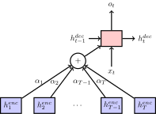

# CSE 849: Deep Learning: Programming Project 3

## Instructor: Vishnu Boddeti

### Instructions
- Submit solutions by directly editing this markdown file. Submissions in other formats will not be graded.
- **Submission:** Only submissions made through GitHub classroom will be graded. Make sure to show all the steps of your derivations in order to receive full credit.
- **Integrity and Collaboration:** You are expected to work on the homeworks by yourself. You are not permitted to discuss them with anyone except the instructor. The homework that you hand in should be entirely your own work. You may be asked to demonstrate how you got any results that you report.
- **Clarifications:** If you have any question, please look at Piazza first. Other students may have encountered the same problem, and is solved already. If not, post your question there. We will respond as soon as possible.
- **Editor and Extensions**: It is best if you edit this markdown file using [Visual Studio Code](https://code.visualstudio.com). Optionally you can install the [Markdown Preview Enchanced](https://shd101wyy.github.io/markdown-preview-enhanced/#/) extension for better support.

### Introduction
In this assignment, you will train two attention-based neural machine translation (NMT) model to translate words from English to Pig-Latin. Along the way, you will gain experience with several important concepts in NMT, including *gated recurrent neural networks*, *attention* and *transformers*.

***Pig Latin:*** It is a simple transformation of English based on the following rules applied on a per-word basis:
- If the first letter of a word is a consonant, then the letter is moved to the end of the word, and the letters "ay" are added to the end. For instance, *team $\rightarrow$ eamtay*.
- If the first letter is a vowel, then the word is left unchanged and the letters "way" are added to the end: *impress $\rightarrow$ impressway*.
- In addition, some consonant pairs, such as "sh", are treated as a block and are moved to the end of the string together: *shopping $\rightarrow$ oppingshay*.

To translate a whole sentence from English to Pig-Latin, we simply apply these rules to each word independently: *i went shopping $\rightarrow$ iway entway oppingshay*

We would like to train a neural machine translation model to learn the rules of Pig-Latin implicitly, from (English, Pig-Latin) word pairs. Since the translation to Pig Latin involves moving characters around in a string, we will use character-level recurrent neural networks for our model. Since English and Pig-Latin are structurally very similar, the translation task is almost a copy task; the model must remember each character in the input, and recall the characters in a specific order to produce the output. This makes it an ideal task for understanding the capacity of NMT models.

***Data:*** The data for this task consists of pairs of words $\{(s^{(i)}, t^{(i)})\}_{i=1}^N$ where the source $s^{(i)}$ is an English word, and the target $t^{(i)}$ is its translation in Pig-Latin. 

To investigate the effect of dataset size on generalization ability, we provided a small and a large dataset. The small dataset is composed of a subset of the unique words from the book “Sense and Sensibility,” by Jane Austen. The vocabulary consists of 29 tokens: the 26 standard alphabet letters (all lowercase), the dash symbol $-$, and two special tokens, start of sentence `<SOS>` and end of sentence `<EOS>`. The dataset contains 3198 unique (English, Pig-Latin) pairs in total; the first few examples are: *$\{$ (the, ethay), (family, amilyfay), (of, ofway), $\dots$ $\}$*

The second, dataset is obtained from Peter Norvig's [natural langauge corpus](https://norvig.com/ngrams/). It contains the top 20,000 most used English words, which is combined with the previous data set to obtain 22,402 unique words. This dataset contains the same vocabulary as the previous dataset.

In order to simplify the processing of mini-batches of words, the word pairs are grouped based on the lengths of the source and target. Thus, in each mini-batch the source words are all the same length, and the target words are all the same length. This simplifies the code, as we don’t have to worry about batches of variable-length sequences.

***Encoder-Decoder NMT Setup:*** Translation is a sequence-to-sequence problem: in our case, both the input and output are sequences of characters. A common architecture used for seq-to-seq problems is the encoder-decoder model [^sutskever2014sequence], composed of two RNNs, as follows:

The encoder RNN compresses the input sequence into a fixed-length vector, represented by the final hidden state $h_T^{enc}$. The decoder RNN conditions on this vector to produce the translation, character by character.

Input characters are passed through an embedding layer before they are fed into the encoder RNN; in our model, we learn a $29\times H$ embedding matrix, where each of the 29 characters in the vocabulary is assigned a $H$-dimensional embedding. At each time step, the decoder RNN outputs a vector of unnormalized log probabilities given by a linear transformation of the decoder hidden state. When these probabilities are normalized, they define a distribution over the vocabulary, indicating the most probable characters for that time step. The model is trained via a cross-entropy loss between the decoder distribution and ground-truth at each time step.

The decoder produces a distribution over the output vocabulary conditioned on the previous hidden state and the output token in the previous time step. A common practice used to train NMT models is to feed in the ground-truth token from the previous time step to condition the decoder output in the current step, as shown in the previous question. At test time, we don't have access to the ground-truth output sequence, so the decoder must condition its output on the token it generated in the previous time step, as shown below.

### Q1: Gated Recurrent Unit (2pts)
The forward pass of a Gated Recurrent Unit [^cho2014learning] is defined by the following equations:
$$
    \begin{aligned}
    r_t =& \sigma(W_{xr}x_t + W_{hr}h_{t-1} + b_r) \\
    z_t =& \sigma(W_{xz}x_t + W_{hz}h_{t-1} + b_z) \\
    g_t =& tanh(W_{xg}x_t + r_t\odot(W_{hg}h_{t-1}+b_g)) \\
    h_t =& (1-z_t) \odot g_t + z_t \odot h_{t-1}
    \end{aligned}
$$

- (1pt) Although PyTorch has a GRU built in (`nn.GRUCell`), we will implement our own GRU cell from scratch, to better understand how it works. Fill in the `__init__` and `forward` methods of the `MyGRUCell` class in `models/gru.py`, to implement the above equations. A template has been provided for the forward method.
- (1pt) Train the RNN encoder/decoder model on both datasets `pig_latin_small.txt` and `pig_latin_large.txt` as follows:

    `python3 main.py --data_file pig_latin_small.txt --encoder GRUEncoder --decoder GRUDecoder`

    `python3 main.py --data_file pig_latin_train.txt --encoder GRUEncoder --decoder GRUDecoder`

    We provided implementations for recurrent encoder/decoder models using the GRU cell. By default, the script runs for 100 epochs. The script also plots the training loss, validation loss and the Pig-Latin translation of a fixed sentence, "the air conditioning is working", to Tensorboard, so that you can see how the model improves qualitatively over time. The script saves the model parameters based on the validation loss in the `results` directory. In your write-up, include training and validation loss plots comparing the plots from training on both datasets. You should be able to download these from Tensorboard by selecting the appropriate log files.

- After the training is complete, the model will translate the words using `translate_sentence` function. Try a few of your own words by adding to the variable `TEST_SENTENCE` in `main.py`.

**Deliverables:**
- A python file with code: `gru.py`
- Create a report with a section called **Gated Recurrent Units**. Include the training/validation loss plots.
- Make sure to add at least one input-output pair for each failure case you identify.

### Q2: Additive Attention (3pts)
Attention allows a model to look back over the input sequence, and focus on relevant input tokens when producing the corresponding output tokens. For our simple task, attention can help the model remember tokens from the input, e.g., focusing on the input letter `c` to produce the output letter `c`.

The hidden states produced by the encoder while reading the input sequence, \{$h_1^{enc}$, $\dots$, $h_T^{enc}$\}, can be viewed as annotations of the input; each encoder hidden state $h_i^{enc}$ captures information about the $i^{th}$ input token, along with some contextual information. At each time step, an attention-based decoder computes a weighting over the annotations, where the weight given to each one indicates its relevance in determining the current output token.

In particular, at time step $t$, the decoder computes an attention weight $\alpha_i$ for each of the encoder hidden states $h_i^{enc}$. The weights are defined such that $0 \leq \alpha_i \leq 1$ and $\sum_{i}\alpha_i = 1$. $\alpha_i$ is a function of an encoder hidden state and the previous decoder hidden state, $f(h_{t-1}^{dec},h_{i}^{enc})$, where $i$ ranges over the length of the input sequence.

There are a few different choices for the possible function $f$. In this assignment we will explore two different attention models: (1) the additive attention using a two-layer MLP, and (2) the scaled dot product attention which measures the similarity between the two hidden states.

To unify the interface across different attention modules, we consider attention as a function whose inputs are triple (queries, keys, values), denoted as $(Q, K, V)$. In the additive attention, we will learn the function $f$, parameterized as a two-layer fully-connected network with a ReLU activation. This network produces unnormalized weights $\tilde{\alpha}_i^{(t)}$ that are used to compute the final context vector.

For the `forward` pass, you are given a batch of query of the current time step, which has dimension `batch_size x hidden_size`, and a batch of keys and values for each time step of the input sequence, both have dimension `batch_size x seq_len x hidden_size`. The goal is to obtain the context vector. We first compute the function $f(Qt, K)$ for each query in the batch and all corresponding keys $K_i$, where $i$ ranges over `seq_len` different values. You must do this in a vectorized fashion. Since $f(Qt, Ki)$ is a scalar, the resulting tensor of attention weights should have dimension `batch_size x seq_len x 1`. The `AdditiveAttention` module should return both the context vector `batch_size x 1 x hidden_size` and the attention weights `batch_size x seq_len x 1`.

We will now apply the AdditiveAttention module to the RNN decoder. You are given a batch of decoder hidden states as the query, $h^{dec}_{t-1}$, for time $t-1$, which has dimension `batch_size x hidden_size`, and a batch of encoder hidden states as the keys and values, $h^{enc}=[h_1^{enc}, \dots, h_i^{enc},\dots]$ (annotations), for each timestep in the input sequence, which has dimension `batch_size x seq_len x hidden_size`.

$$
	Q_t \leftarrow h^{dec}_{t-1} \quad K \leftarrow h^{enc} \quad V \leftarrow h^{enc}
$$

We will use these as the inputs to the self.attention to obtain the context. The output context vector is concatenated with the input vector and passed into the decoder GRU cell at each time step, as shown in the figure below. Fill in the forward method of the `RNNAttentionDecoder` class to implement the interface shown in the figure below. You will need to implement the following steps :

- Get the embedding corresponding to the time step. (provided)
- Compute the context vector and the attention weights using `self.attention`. (implement)
- Concatenate the context vector with the current decoder input. (implement)
- Feed the concatenation to the decoder GRU cell to obtain the new hidden state. (provided)

- Train the model with attention by running the following command. By default, the script runs for 100 epochs, which should be enough to get good results.

    `python3 main.py --data_file pig_latin_large.txt --encoder GRUEncoder --decoder GRUAttentionDecoder`

- The training and validation loss curves. How do they compare to the model without the attention layer?

**Deliverables:** Create a section called Additive Attention and include the following in this section:
- Python files with code: `models/attention.py` and `models/gru_dec_attn.py`
- Create a section called **Additive Attention**. Include the training/validation loss plots.
- Make sure to add at least one input-output pair for each failure case you identify.

### Q3: Scaled Dot Product Attention (3pts)
In the lecture, we introduced Scaled Dot-product Attention used in the transformer models. The function $f$ is a dot product between the linearly transformed query and keys using weight matrices $\mathbf{W}_q$ and $\mathbf{W}_k$:
$$
\begin{aligned}
\tilde{\alpha}_i^{(t)} =& f(\mathbf{Q}_t,\mathbf{K}_i) = \frac{(\mathbf{W}_q\mathbf{Q}_t)^T(\mathbf{W}_k\mathbf{K}_i)}{\sqrt{d}} \\
\alpha_i^{(t)} =& softmax(\tilde{\alpha}^{(t)})_i \\
\mathbf{c}_t =& \sum_{i=1}^T \alpha_i^{(t)}\mathbf{W}_v\mathbf{v}_i
\end{aligned}
$$

where, $d$ is the dimension of the query and $\mathbf{W}_v$ is the weight matrix corresponding to the values $\mathbf{v}_i$.

- Fill in the forward methods of the `ScaledDotAttention` class in `models/attention.py`. Use the `torch.bmm` command to compute the dot product between the batched queries and the batched keys in the forward pass of the `ScaledDotAttention` class for the unnormalized attention weights. The following functions are useful in implementing models like this. You might find it useful to get familiar with how they work. (click to jump to the PyTorch documentation): [squeeze](https://pytorch.org/docs/stable/torch.html#torch.squeeze), [unsqueeze](https://pytorch.org/docs/stable/torch.html#torch.unsqueeze), [cat](https://pytorch.org/docs/stable/torch.html#torch.cat), [expand_as](https://pytorch.org/docs/stable/tensors.html#torch.Tensor.expand_as), [view](https://pytorch.org/docs/stable/tensors.html?#torch.Tensor.view), [bmm](https://pytorch.org/docs/stable/generated/torch.bmm.html). Your forward pass needs to work with both 2D query tensor `batch_size x hidden_size` and 3D query tensor `batch_size x k x hidden_size`.
- Fill in the forward method in the `CausalScaledDotAttention` class in `models/attention.py`. It will be mostly the same as the `ScaledDotAttention` class. The additional computation is to mask out the attention to the future time steps. You will need to add `self.neg_inf` to some of the entries in the unnormalized attention weights. You may find [torch.tril](https://pytorch.org/docs/stable/generated/torch.tril.html) handy for this part.
- We will now use `ScaledDotAttention` as the building blocks for a simplified transformer [^vaswani2017attention] encoder. The encoder consists of three components (already provided):
    - Positional encoding: Without any additional modifications, self attention is permutation-equivariant. To encode the position of each word, we add to its embedding a constant vector that depends on its position:
    $$
    \text{pth word embedding} = \text{input embedding} + \text{positional encoding(p)}
    $$
    We follow the same positional encoding methodology described in [^vaswani2017attention]. That is we use sine and cosine functions:
    $$
        \begin{aligned}
            PE(pos, 2i) =& \sin \frac{pos}{10000^{2i/d_{model}}} \\
            PE(pos, 2i+1) =& \cos \frac{pos}{10000^{2i/d_{model}}} \\
        \end{aligned}
    $$
    - A `ScaledDotAttention` operation
    - An MLP
    Now, complete the forward method of TransformerEncoder. Most of the code is provided, except for a few lines. Complete these lines.

- The decoder, in addition to all the components the encoder has, also requires a `CausalScaledDotAttention` component. The transformer solves the translation problem using layers of attention modules. In each layer, we first apply the `CausalScaledDotAttention` self-attention to the decoder inputs followed by `ScaledDotAttention` attention module to the encoder annotations, similar to the attention decoder from the previous question. The output of the attention layers are fed into an hidden layer using ReLU activation. The final output of the last transformer layer are passed to `self.out` to compute the word prediction. To improve the optimization, we add residual connections between the attention layers and ReLU layers. Now, complete the forward method of `TransformerDecoder`. Again, most of the code is given to you - fill out the few missing lines.
- Now, train the language model with transformer based encoder/decoder using the first configuration (hidden size 32, small dataset). How do the translation results compare to the previous decoders? Write a short, qualitative analysis.

`python3 main.py --data_file pig_latin_small.txt --encoder TransformerEncoder --decoder TransformerDecoder --hidden_size 32`

- We will compare the performance of the model with respect to the hidden size and dataset size. Run the Transformer model using hidden size 32 versus 64, and using the small versus large dataset (in total, 4 runs) as follows:

`python3 main.py --data_file pig_latin_small.txt --encoder TransformerEncoder --decoder TransformerDecoder --hidden_size 32`

`python3 main.py --data_file pig_latin_small.txt --encoder TransformerEncoder --decoder TransformerDecoder --hidden_size 64`

`python3 main.py --data_file pig_latin_large.txt --encoder TransformerEncoder --decoder TransformerDecoder --hidden_size 32`

`python3 main.py --data_file pig_latin_large.txt --encoder TransformerEncoder --decoder TransformerDecoder --hidden_size 64`

Run these experiments, and report the effects of increasing hidden size and dataset size. In particular, how is the generalization of the model change with model/dataset size. Are these results what you would expect? In your report, include plots comparing the training and validations losses for the four runs.

- Modify the transformer decoder `__init__` to use non-causal attention for both self attention and encoder attention. What do you observe when training this modified transformer? How do the results compare with the causal model? Why?
- What are the advantages and disadvantages of using additive attention vs scaled dot-product attention? List one advantage and one disadvantage for each method.

**Deliverables:** Create a section in your report called Scaled Dot Product Attention. Include the following:
- Python files with code: `models/attention.py`, `models/transformer_enc.py` and `models/transformer_dec.py`
- Training/validation plots you generated.
- Your response to question 5, 6, 7 and 8.

### Q4: Visualizing Attention (2pts)
One of the benefits of using attention is that it allows us to gain insight into the inner workings of the model. By visualizing the attention weights generated for the input tokens in each decoder step, we can see where the model focuses while producing each output token. The code in the previous parts of the assignment will generate visualizations of attention maps learned by your model. You can find them in Tensorboard. Add words to the `TEST_WORDS` list in `main.py` and find interesting success and failure modes that illustrate the behavior of different attention-based models.

Some interesting classes of words you may want to try are:
- Words that begin with a single consonant (e.g., fake).
- Words that begin with two or more consonants (e.g., brink).
- Words that have unusual/rare letter combinations (e.g., aardvark).
- Compound words consisting of two words separated by a dash (e.g., long-term). These are the hardest class of words present in the training data, because they are long, and because the rules of Pig-Latin dictate that each part of the word (e.g., well and mannered) must be translated separately, and stuck back together with a dash: onglay-ermtay.
- Made-up words or toy examples to show a particular behavior.

Include attention maps for both success and failure cases in your writeup, along with your hypothesis about why the model succeeds or fails.

### Submission

- Edited `README.md` file containing your answers to the conceptual questions, plots and the attention visualizations with explanations.

[^sutskever2014sequence]: Ilya Sutskever, Oriol Vinyals, and Quoc V Le. Sequence to sequence learning with neural networks. In Advances in Neural Information Processing Systems, pages 3104–3112, 2014.
[^cho2014learning]: Kyunghyun Cho, Bart Van Merri¨enboer, Caglar Gulcehre, Dzmitry Bahdanau, Fethi Bougares, Holger Schwenk, and Yoshua Bengio. Learning phrase representations using rnn encoder-decoder for statistical machine translation. arXiv preprint arXiv:1406.1078, 2014.

[^vaswani2017attention]: Ashish Vaswani, Noam Shazeer, Niki Parmar, Jakob Uszkoreit, Llion Jones, Aidan N Gomez, Łukasz Kaiser, and Illia Polosukhin. Attention is all you need. In Advances in neural information processing systems, pages 5998–6008, 2017.