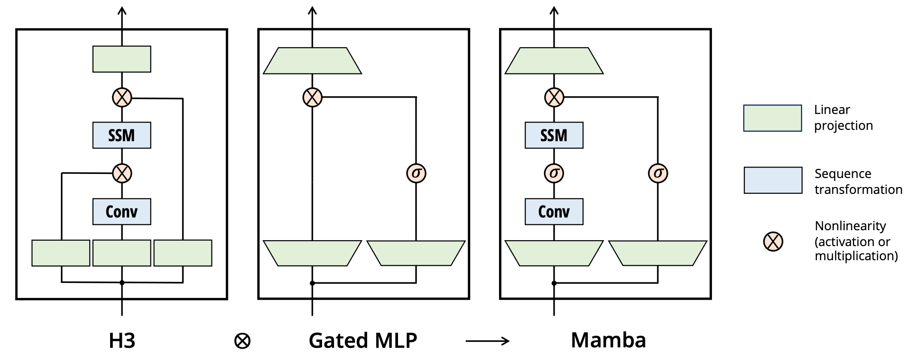
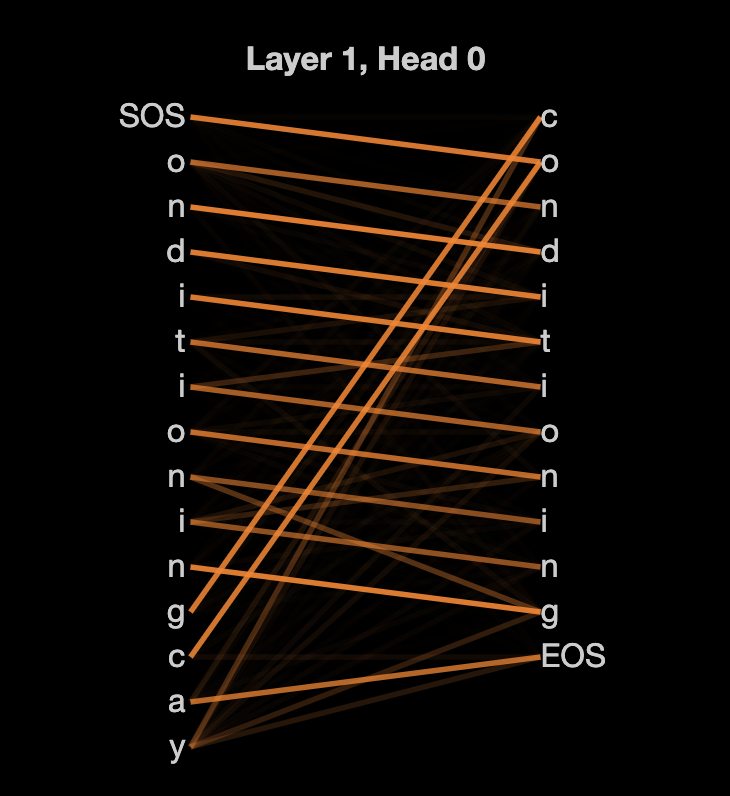

# CSE 849: Deep Learning: Sequence-to-Sequence

## Instructor: Vishnu Boddeti

### Instructions

- Submit solutions by directly editing this markdown file. Submissions in other formats will not be graded.
- **Submission:** Only submissions made through GitHub Classroom will be graded. To receive full credit, make sure to show all the steps of your derivations.
- **Integrity and Collaboration:** You are expected to work on the homework independently. You are not permitted to discuss them with anyone except the instructor. The homework that you hand in should be entirely your work. You may be asked to demonstrate how you got any results you report.
- **Clarifications:** If you have any questions, please look at Piazza first. Other students may have encountered the same problem, which has already been solved. If not, post your question there. We will respond as soon as possible.
- **Editor and Extensions**: It is best to edit this Markdown file using Visual Studio Code. For better support, you can also install the Markdown Preview Enhanced extension.

### Introduction

In this assignment, you will train two attention-based neural machine translation (NMT) models to translate words from English to Pig-Latin. Along the way, you will gain experience with several important concepts in NMT, including *attention,* *transformers*, and *state-space models*.

***Pig Latin:*** It is a simple transformation of English based on the following rules applied on a per-word basis:

- If the first letter of a word is a consonant, then the letter is moved to the end of the word, and the letters "ay" are added to the end. For instance, *team $\rightarrow$ eamtay*.
- If the first letter is a vowel, then the word is left unchanged, and the letters "way" are added to the end: *impress $\rightarrow$ impressway*.
- In addition, some consonant pairs, such as "sh", are treated as a block and are moved to the end of the string together: *shopping $\rightarrow$ oppingshay*.

To translate a whole sentence from English to Pig-Latin, we simply apply these rules to each word independently: *i went shopping $\rightarrow$ iway entway oppingshay*

We want to train a neural machine translation model to implicitly learn the rules of Pig-Latin from (English, Pig-Latin) word pairs. Since the translation to Pig Latin involves moving characters around in a string, we will use character-level neural networks for our model. Since English and Pig-Latin are very similar structurally, the translation task is almost a copy task; the model must remember each character in the input and recall the characters in a specific order to produce the output. This makes it an ideal task to understand the capacity of NMT models.

***Data:*** The data for this task consists of pairs of words $\{(s^{(i)}, t^{(i)})\}_{i=1}^N$ where the source $s^{(i)}$ is an English word, and the target $t^{(i)}$ is its translation in Pig-Latin. 

We provided a small and a large dataset to investigate the effect of dataset size on generalization ability. The small dataset comprises a subset of the unique words from the book “Sense and Sensibility,” by Jane Austen. The vocabulary consists of 29 tokens: the 26 standard alphabet letters (all lowercase), the dash symbol $-$, and two special tokens, start of sentence `<SOS>` and end of sentence `<EOS>`. The dataset contains 3198 unique (English, Pig-Latin) pairs in total; the first few examples are: *$\{$ (the, ethay), (family, amilyfay), (of, ofway), $\dots$ $\}$*

The second dataset is obtained from Peter Norvig's [natural language corpus](https://norvig.com/ngrams/). It contains the top 20,000 most used English words, which is combined with the previous data set to obtain 22,402 unique words. This dataset contains the same vocabulary as the previous dataset.

To simplify the processing of mini-batches of words, the word pairs are grouped based on the lengths of the source and target. Thus, in each mini-batch, the source words are all the same length, and the target words are all the same length. This simplifies the code, as we don’t have to worry about batches of variable-length sequences.

### Q1: Transformer Models (5pts)

***Encoder-Decoder NMT Setup:*** Translation is a sequence-to-sequence problem: in our case, both the input and output are sequences of characters. A common architecture used for seq-to-seq problems is the encoder-decoder model [^sutskever2014sequence], composed of two sequence models, as follows:

**Scaled Dot-Product Attention:** In the lecture, we introduced Scaled Dot-product Attention used in the transformer models. The function $f$ is a dot product between the linearly transformed query and keys using weight matrices $\mathbf{W}_q$ and $\mathbf{W}_k$:
$$
\begin{aligned}
\tilde{\alpha}_i^{(t)} =& f(\mathbf{Q}_t,\mathbf{K}_i) = \frac{(\mathbf{W}_q\mathbf{Q}_t)^T(\mathbf{W}_k\mathbf{K}_i)}{\sqrt{d}} \\
\alpha_i^{(t)} =& softmax(\tilde{\alpha}^{(t)})_i \\
\mathbf{c}_t =& \sum_{i=1}^T \alpha_i^{(t)}\mathbf{W}_v\mathbf{v}_i
\end{aligned}
$$

where, $d$ is the dimension of the query, and $\mathbf{W}_v$ is the weight matrix corresponding to the values $\mathbf{v}_i$.

- Fill in the forward method in the `MultiHeadAttention` class in `models/transformer.py`. In this part, you will implement both standard "Scaled Dot Attention" for the encoder and "Causal Scaled Dot Attention" for the decoder. Use the `einsum` command to compute the dot product between the batched queries and the batched keys in the forward pass. The following functions are useful in implementing models like this. It is useful to get familiar with how they work. (click the links to jump to the documentation): [einsum - Einops](https://einops.rocks/api/einsum/), [rearrange - Einops](https://einops.rocks/api/rearrange/), [repeat - Einops](https://einops.rocks/api/repeat/) and [reduce - Einops](https://einops.rocks/api/reduce/). For the "Causal Scaled Dot Attention," we must mask the attention for the future steps. You must add `self.neg_inf` to some of the entries in the attention. You may find [torch.tril](https://pytorch.org/docs/stable/generated/torch.tril.html) handy for this part.

- We will now use `MultiHeadAttention` as the building blocks for a transformer [^vaswani2017attention] encoder. The encoder consists of three components (already provided):

    - Positional encoding: Without any additional modifications, self-attention is permutation-equivariant. To encode the position of each word, we add to its embedding a constant vector that depends on its position:
    $$
    \text{pth word embedding} = \text{input embedding} + \text{positional encoding(p)}
    $$
    We follow the same positional encoding methodology described in [^vaswani2017attention]. That is, we use sine and cosine functions:
    $$
    \begin{aligned}
            PE(pos, 2i) =& \sin \frac{pos}{10000^{2i/d_{model}}} \\
            PE(pos, 2i+1) =& \cos \frac{pos}{10000^{2i/d_{model}}} \\
        \end{aligned}
    $$
    - A `MultiHeadAttention` operation
    - An MLP

    Now, complete the forward method of TransformerEncoder. Most of the code is provided except for a few lines. Complete these lines.

- The decoder is similar to the encoder, except it utilizes the "Causal Scaled Dot Attention". The transformer solves the translation problem using layers of attention modules. In each layer, we first apply the "Causal Scaled Dot Attention" self-attention to the decoder inputs, followed by the "Scaled Dot Attention" attention module to the encoder annotations. The output of the attention layers is fed into a hidden layer using GELU activation. The final output of the last transformer layer is passed to `self.out` to compute the word prediction. We add residual connections between the attention and GELU layers to improve the optimization. Now, complete the forward method of `TransformerDecoder`. Again, most of the code is given to you - fill out the few missing lines.

- You will compare the model's performance with respect to the hidden and dataset sizes. Run the Transformer model using hidden size 32 versus 64 and using the small and large dataset (in total, 4 runs) as follows:

Change `hidden_size` in the config file to 32 and then run:

`python3 main.py --config exps/args_piglatin_small_transformer.txt`

`python3 main.py --config exps/args_piglatin_large_transformer.txt`

Change `hidden_size` in the config file to 64 and then run:

`python3 main.py --config exps/args_piglatin_small_transformer.txt`

`python3 main.py --config exps/args_piglatin_large_transformer.txt`

Run these experiments and report the effects of increasing hidden size and dataset size. In particular, how does the model's generalization change with model/dataset size? Are these results what you would expect? In your report, include plots comparing the training and validation losses for the four runs.

- You can modify the transformer configuration as you please, adding more transformer layers or increasing the number of attention heads, optimizer, learning rate scheduler, etc. Report the training and validation loss curves for your modification. What do you observe when training this modified transformer? Is it better than the default settings? Why?

**Deliverables:** Create a section in your report called Transformer. Include the following:

- Python files with code: `models/transformer.py`
- Training/validation plots you generated.
- Your response to the questions above.

### Q2: State-Space Models (5pts)

A state-space model compresses the input sequence into a fixed-length vector. The predictor is conditioned on this vector to produce the character-by-character translation. The hidden state is typically initialized to $h^{enc}_0=\mathbf{0}$.

Input characters are passed through an embedding layer before they are fed into the state-space model; in our model, we learn a $29\times H$ embedding matrix, where each of the 29 characters in the vocabulary is assigned a $H$-dimensional embedding. At each time step, the state-space model outputs a vector of unnormalized log probabilities given by a linear transformation of the hidden state. When these probabilities are normalized, they define a distribution over the vocabulary, indicating the most probable characters for that time step. The model is trained via a cross-entropy loss between the predicted distribution and ground truth at each time step.

The output vocabulary distribution is conditioned on the previous hidden state and the output token in the previous time step. A common practice used to train NMT models is to feed in the ground-truth token from the previous time step to condition the decoder output in the current step, as shown in the previous question. We don't have access to the ground-truth output sequence at test time, so the state-space model must condition its output on the token it generated in the previous time step, as shown below.

Specifically, we will implement the state-space model introduced in [[2312.00752\] Mamba: Linear-Time Sequence Modeling with Selective State Spaces (arxiv.org)](https://arxiv.org/abs/2312.00752). The Mamba architecture involves a Mamba Block (see below) that is repeated many times.

The state-space model in Mamba is parameterized as follows:

$h'(t) = Ah(t) + Bx(t)$

$y(t) = Ch(t) + Dx(t)$​

- **Discretizing the SSM (1pt):** The continuous state-space model must be discretized before implementation. There are multiple choices for discretization, such as Zero-Order Hold, Forward Euler, Backward Euler, Bilinear Interpolation, etc. You will derive the Bilinear interpolation-based discretization. In the general case, for $x'(t)=f(x(t))$, the forward Euler discretizes as $x_{k+1}=x_{k} + \Delta f(x_k)$, and the backward Euler discretizes as $x_{k+1}=x_{k} + \Delta f(x_{k+1})$. The bilinear interpolation discretizes as $x_{k+1} = x_{k} + \Delta (\alpha f(x_k) + (1-\alpha)f(x_{k+1})) \text{ where } 0\leq\alpha\leq 1$. Setting $\alpha=0$ leads to backward Euler, $\alpha=1$ leads to forward Euler, and $\alpha=0.5$ was used in the [^S4] model. Discretize the state space model using this bilinear interpolation.

  $h_k = \bar{A}h_{k-1} + \bar{B}x_k$

  $y_k = \bar{C}h_k + \bar{D}x_k$

  Express the matrices $\bar{A}, \bar{B}, \bar{C}, \bar{D}$ in terms of $A, B, C, D, \Delta$. The Mamba implementation uses the zero-order hold and has already been implemented for you.

- **Parallel Scan (1pt):** As we saw in class, the update to the state space model can be implemented with a simple sequential scan, which has already been implemented for you. In this part, you will implement the parallel scan following the idea in [^heinsen2023scan]

- **Implementing Mamba (2 pts):** Now, you will implement the Mamba Block, from which the rest of the Mamba architecture is constructed. Most of the code has been written for you. Fill in the few missing lines. 

- You will train the Mamba model and compare its performance to the transformer in terms of validation loss, number of parameters, and latency.  Run the Mamba model using hidden size 32 versus 64 and using the small and large dataset (in total, 4 runs) as follows:

Change `hidden_size` in the config file to 32 and then run:

`python3 main.py --config exps/args_piglatin_small_transformer.text`

`python3 main.py --config exps/args_piglatin_large_transformer.text`

Change `hidden_size` in the config file to 64 and then run:

`python3 main.py --config exps/args_piglatin_small_mamba.py`

`python3 main.py --config exps/args_piglatin_large_mamba.py`

- **Bonus (2 pts):** You can modify the Mamba configuration by adding more SSM layers, initialization of $\bar{A}$, optimizer, learning rate scheduler, etc. Report the training and validation loss curves for your modification. What do you observe when training this modified transformer? Is it better than the default settings? Why?

# Writeup

## Introduction

I have closely followed the "Attention is All You Need" [^vaswani2017attention] and GPT [^GPT] papers to implement a transformer. The goal is to understand the inner workings of transformers to the extent that We try to improve performance on the Pig Latin task.

One of the core components of transformers is the attention mechanism. Each layer of the transformer comprises three such attention blocks: encoder self-attention, decoder self-attention, and cross-attention. Understanding these attention components is crucial to comprehend how information is transmitted from the source to the target. In the visualization section, We demonstrate that the current word of the encoder will have information only from the previous word in the cross-attention, and this will help cross attention module pick the next word given the current word.

In all NLP tasks, embeddings play a crucial role. We have observed this phenomenon in [HW-1](https://github.com/msu-deep-learning/homework-1-sachit3022/). Do we observe similar clusters for this task? Do vowels and consonants form clusters? Are "-" and "[EOS]" closer to each other? However, we don't observe such a phenomenon in this task. Wr hypothesize that the model's embedding space is large compared to the vocabulary dimension. It has the capacity to make all tokens orthogonal to each other. Maybe we can observe this phenomenon when we significantly reduce hidden dimensions.

Can we make any other modifications to improve the performance of the task? The task for Pig Latin relies on positions, as we can observe from the attention maps. So, instead of having cosine positional embeddings, can we train them to improve performance? We demonstrate that training positional embeddings increases performance on this task.

Finally, we perform an ablation study and show which hyperparameters are more influential.

## Preliminaries

**Loss Computation:** We measure the loss values per character. This makes the interpretation of loss simpler. Suppose the loss value is $-\log(\frac{1}{29}) = \log{29}$. This indicates on average model is predicting characters at random. We use this notion because the loss per word is often misleading when there is an imbalance in errors with respect to word length. We show that this is the case, where the model makes mistakes for longer words compared to smaller ones. This leads to a larger value than the simpler metric of average across words.

**Accuracy:** We compute how many words are predicted correctly, which provides a true metric. Even if the architecture or model is wrong, because train and validation sets are sampled from the same distribution, the loss will be very low but the model will output garbage.

## Interpretability of Transformers

For understanding the visualisation, we will use a smaller model, 2 encoders, 2 decoders and just 2 attention heads, we will keep the embeddings as 64.  We will study 3 different words which represents different type of translations in piglatin

(1) brown -> ownbray

(2) conditioning -> onditioningcay

(3) is -> isway

We use [^bertviz] to visualise the attention.

|   | brown  | conditioning  | is  | 
|---|---|---|---|
| Encoder Self attention  |   |   |   |  
| Cross Attention  |   |   || 

### Explanation of the Attention Module

One of the heads in the attention mechanism has the specific job of retaining information from the previous token. This is essential for the decoder to predict the next word accurately. Furthermore, when the "[EOS]" token is reached, this head should contain information about the first character. If the two vectors are exactly the same, the dot product is large (close to 1).

This can be depicted visually as follows:

The image illustrates the behavior of head 0. Encoder attention will only retain information about the previous token, making it easier for the decoder to predict the next one as the dot product with the same vectors is maximized.

This image demonstrates the behavior of head 1. In this case, the encoder doesn't learn anything, or you can think of it as learning identity. The embeddings of "[SOS]" are learned such that they are closer to the first vowel (position + vowel embedding). This head aids in predicting the first character. For subsequent character predictions, head 0 will handle them.

Cross attentions are perfect in a sense that "[SOS]" attends to the first vowel, and then the next character will attend to the character that it will be predicting. If the word is the last word, it automatically points to the first word and continues generating until reaching the "[SOS]" matched token, then looks at `EOS`, and generates `ay`.

## visualisation of embeddings

Expected a cluster around the vowels and consonants however no such pattern has emerged in learning embeddings, that implies it leart these embeddings differents and it memorises a,e,i,o,u differently.

## Abalation study

In our experimentation, we found that there isn't much tuning required for the architecture itself. Interestingly, we concluded that for this task, the transformer architecture is relatively easier to tune. Even the base model, with no tuning, achieves a validation accuracy of 91%. 

When we increase the model's capacity, the performance initially improves significantly, but eventually, it saturates because the training reaches perfect accuracy. However, a heavily tuned model Mamba performs slightly better than heavily tuned transformer.

In our ablation study, we aim to investigate the importance of different modules within the transformer architecture and how their significance changes with the scale of these modules.

In the following experiment, we consider the model with the below parameters as a base model. We only change one hyperparameter at one time 

| hyper parameter | val |
|---|---|
| hidden diamension | 64 |
| head size | 16 |
| num of encoder layers | 2 |
| num of decoder layers | 2 |
| batch size | 128 |
| learning rate | 3e-3 |
| number of epochs | 100 |

| Model |  val loss | train loss| val accuracy  | train accuracy|
|---|---|---|---|---|
| Base |0.043  | 0.050      |   0.909  |  0.957   |

Sample mistakes made by the Base model

| True value | Wrong prediction |
|---|---|
|acrossway | acrosssway|
|adieusway | adieussway|
|ankleway | ankleeway|
|oodgay-umouredhay|oodgay-mouray-odha|

Most identified mistakes involve starting with a vowel and not knowing the end, resulting in repeating the final character.

**Observation: Mistakes are due to inefficient encoding of postion**

Consider the task of Pig Latin transformation. To predict the next character, we need information from the previous character. Therefore, time plays a more important role than character embeddings.

The attention maps also support this conclusion. Now, if the positional embeddings are crucial, what if we remove them? Will there be a significant drop in accuracy?

There is indeed a substantial drop in accuracy when we drop the positional embeddings, as this task relies heavily on remembering the positional embeddings. Having them improves accuracy by 40%.

### Impact of Training Positional Embeddings

As we establish that positional encodings are important, does training them improve performance?

| Output Pos Embeddings | Validation Loss | Train Loss | Validation Accuracy | Train Accuracy |
|-----------------------|-----------------|------------|---------------------|----------------|
| Disable               | 0.232           | 0.114      | 0.576               | 0.858          |
| Train                 | 0.033           | 0.004      | 0.962               | 1.000          |

Training positional encodings significantly improves performance for this task because word shifts are based more on positional embeddings than on the embeddings of the words. This results in an improvement of 5.83%.

Lets look at the learning embeddings ( initialised with the embeddings from attention is all you need paper.)

### Impact of Number of Heads

We will analyze the performance with the increase in head size:

| Head Size | Validation Loss | Train Loss | Validation Accuracy | Train Accuracy |
|-----------|-----------------|------------|---------------------|----------------|
| 4         | 0.070           | 0.049      | 0.853               | 0.970          |
| 8         | 0.059           | 0.034      | 0.912               | 0.971          |
| 16        | 0.043           | 0.050      | 0.909               | 0.957          |

The best performance we have found is with 8 heads, each with a dimension of 8, resulting in a hidden dimension of 64. We found that balancing the number of heads and the dimension of each head is crucial to improving performance.

### Impact of Hidden Dimension

| Dimension Size | Validation Loss | Train Loss | Validation Accuracy | Train Accuracy |
|----------------|-----------------|------------|---------------------|----------------|
| 32             | 0.106           | 0.137      | 0.779               | 0.923          |
| 64             | 0.043           | 0.050      | 0.909               | 0.957          |

Decreasing the dimension of the hidden size results in a drop in performance.

### Impact of Number of Layers

| Layers | Validation Loss | Train Loss | Validation Accuracy | Train Accuracy |
|--------|-----------------|------------|---------------------|----------------|
| 2      | 0.086           | 0.071      | 0.842               | 0.935          |
| 4      | 0.043           | 0.050      | 0.909               | 0.957          |
| 8      | 0.120           | 0.016      | 0.812               | 0.984          |

The encoder and decoder layers of 2 each give better performance. Increasing the layers starts to increase the training performance but deteriorates the validation performance.

### Engineering Improvements

**Accumulated Gradients:** To ensure stochastic gradient convergence to gradient descent, we train with accumulated gradients over 5 epochs to account for the violation of the assumption of randomly sampled samples in a single batch, as our single batch contains identical lengths.

## The Ultimate Beast Model

With 64 hidden dimensions, 8 attention heads, and 2 layers each for encoder and decoder, training the positional encoders. 

A few small modifications were made to improve performance, such as adjusting the scheduler. We observed that the ReduceLROnPlateau scheduler lags behind in training, as it trains one more epoch on high learning rate and the threshold is harder to tune, with increasing the threshold having unstudied effects on performance. Therefore, we opted for CosineAnnealing as a scheduler, as used by the GPT-3 paper, training for 100 epochs and with a weight decay of 0.01. The only difference from GPT is that we use accumulated gradients to account for variation in size.

The only change made from going from small to large is the number of layers, from 2 each to 4 each.

| Model                | Validation Loss | Train Loss | Validation Accuracy | Train Accuracy |
|----------------------|-----------------|------------|---------------------|----------------|
| Beast Small (143K)   | 0.025           | 0.004      | 0.970               | 1.000          |
| Beast Large (276K)   | 0.036           | 0.006      | 0.964               | 1.000          |

The Beast Small model makes only 3 mistakes:

| Latin            | True Pig Latin Value | Wrong Translation       |
|------------------|----------------------|-------------------------|
| pleasure-grounds| easureplay-oundsgray | easureplay-ouredsplay   |
| strengthening    | engtheningstray      | engtheneningstra        |
| thoughtfulness   | oughtfulnessthay     | oughtfulneststhay       |

### Training Progress

| Metric (40 steps = 1 epoch, 40 * 100 = 4K) | Validation | Training |
|--------------------------------------------|------------|----------|
| Loss                                       |  |  |
| Accuracy                                   |    |    |
| Learning Rate                              |            |              |

Few more corrections to the code:
1. in pytorch lightning `scheduler` should be named to `lr_scheduler`
2. self.model.eval() in generate else the test cases after the training will still be in train mode.
3. accumulate gradients.

# Mamba 

## Introduction

Similar to transformer, We study various properties of Mamba architecture.

The core block of Mamba architecture or any RNN architecture is the state transition matrix. In experiments below we study how state transition matrix paramerterised by  $A, \nabla$ is responible for making the prediction. 

One of the key take away from the experiments we perform on Mamba is that 

### Question is choice of A improtant?

Initialising transition matrix to I matrix, which means initialising if A_log to I. that means we can extend to long context without decaying the hidden state will improve. 

| Model |  val loss | train loss| val accuracy  | train accuracy|
|---|---|---|---|---|
| Approx  zeroth order hold [^mamba] | 0.107   | 0.002    |   0.818  | 0.997  |
| Exact zeroth order hold (equation 3) [^mamba]|0.142 | 0.001     |     0.808|  0.998     |
| bi linear interpolation [^S4]| 0.119  | 0.002    |   0.873 | 0.998    |

From here we will perform our experiments with bi linear interpolation as the discreetisation step.

One of the important attributes of understand the state transition matrix, A  we will analyse the properties of it. We will start with the base case as mentioned in the codebase. we will try to improve matrix A, for this task.

Fix the A_log to be e, which means the state transition ($e^{A\nabla} = e^{\nabla}$) is entirely controled by $nabla$. we call this setting as only $\nabla$, we try to observe what $\nabla$ will pick up.

We will visualise the $\nabla$ as well as weighted average of charecter prosition, which chrecter is getting more weight, as it will be weight decay we observe few things that make it very similar to RNNs

We will derive what happens when A is -I.
From the zeroth order hold

$$h_t = e^{A\nabla_t}h_{t-1} + x'_t$$
$$h_t = e^{-\nabla_t}h_{t-1} + x'_t$$
$$h_t = e^{-\nabla_t}h_{t-1} + x'_t$$
$$h_t = e^{-\nabla_t}x'_{t-1} + x'_t + e^{-\nabla_t -\nabla_{t-1} } x'_{t-1} \cdots$$
$$h_t = \sum_t w_t x'_{t}$$
where $w_t = e^{-\sum_t \nabla_t}$

we will plot the  $w_t$ for few words and understand what is done by SSMs.

|   |  conditioning | easureplay-oundsgray  | is  | 
|---|---|---|---|
| Weight given to each charecter  |   |   |   |  
| dt vector  |   |   || 

As you can see that the weight stops at the [EOS] token and almost of them have 0 weight after it. Therefore we can assume that the SSMs add the entire context word to the EOS token and starts decoding it for this task. However this behaviour might change for long range arena as Fixing A will not give us better performance. However for this task SSM behave equivalent to RNNs.

One small advantage of RNN is adaptability here in case - it also stops at -

| Model |  val loss | train loss| val accuracy  | train accuracy|comments|
|---|---|---|---|---|---|
| $\nabla$ training and A = -I|0.168|   0.003       |  0.833       | 0.997   |images in the above table|
| A training and $\nabla$ as Pos embedding  | |         |         |  ||
| A training and $\nabla$ as constant time step  | 0.157 |  0.002     |   0.839     | 0.997   ||
| A= -I and  $\nabla$ as Pos embedding | |        |          |   ||

These set of experiments answer all the questions for us in SSMs.

We will start as usual, Tuning learning rate is very esential for getting the best performance from Mamba. We will tune the learning rate from 3e-4, however we found the learning rate is very small for mamba and we increase it to 3e-3 and found it to be ideal for out task. We use all the other parameters as default. And try to push the accuracy of the base model.

| Model |  val loss | train loss| val accuracy  | train accuracy|
|---|---|---|---|---|
| Base | 0.237   | 0.003    |   0.654 |  0.996     |

### Discretisation

State space models 

| Model |  val loss | train loss| val accuracy  | train accuracy|
|---|---|---|---|---|
| Approx  zeroth order hold [^mamba] | 0.237   | 0.003    |   0.654 |  0.996     |
| Exact zeroth order hold (equation 3) [^mamba]| 0.252  | 0.004    |    0.638 |  0.998     |
| bi linear interpolation [^S4]| 0.175   | 0.002    |   0.833 | 0.998    |

### P-scan vs S-scan

We will compare the time we improved by implementing pscan vs sscan with the torch.compile we see that pscan perform significantly better but why there is a difference in performance when we run without compile and also not sure on the behaviour of torch.compile but as we run with compile we see significant boost in time when pscan is used compared to scan.

**precesion of pscan and scan**
As pscan is an parallel implementation of sscan, Due to the log and exponentional the precision comes into play, when dealing with large numbers. Also we are approximating $\log{0} = -12$. This leads to not exact solution, we measure how pscan and scan deviate. For smaller context length and logits distributed as $\mathcal{N}(0,I)$, the error grows with increasing context length as well as deviating form normal behaviour of logits. 

Other minor experiments that didnot lead significant outcomes
(32,2) v_num: 153.000 val_loss: 0.153 val_acc: 0.844 train_loss: 0.011 train_acc: 0.996   
(64 1) val_loss: 0.167 val_acc: 0.867 train_loss: 0.004 train_acc: 0.997    

Final comments on  Mamba architecture,

### Experimental details
We will train the architecture with default the  

| hyper parameter | val |
|---|---|
| hidden diamension | 64 |
| kernel size | 16 |
| expansion factor | 2 |
| num of layers | 2 |
| batch size | 128 |
| learning rate | 3e-3 |
| Scheduler |Reduce on plateau|
| number of epochs | 100 |

On small change made to the architecture is we devide delta by $\sqrt{\textit{hidden size}}$ This bring stability to training ( credits: Ramin Akbari)

| Model |  val loss | train loss| val accuracy  | train accuracy|
|---|---|---|---|---|
| Mamba small ( 162 K  )| 0.144  | 0.002    |  0.870 | 0.998     |
| Mamba large ( 276 K ) | 0.015  | 0.000  |   0.983  |  0.998  |

More details on training

| Metric (40 steps = 1epoch 40*100 = 4K)   | validation  | training  |
|---|---|---|
|Loss |  | |
|Accuracy| | |
| Learning rate | | |

### Submission

- Edited `README.md` file containing your answers to the conceptual questions, plots, and results with explanations.

[^sutskever2014sequence]: Ilya Sutskever, Oriol Vinyals, and Quoc V Le. Sequence to sequence learning with neural networks. In Advances in Neural Information Processing Systems, pages 3104–3112, 2014.

[^cho2014learning]: Kyunghyun Cho, Bart Van Merri¨enboer, Caglar Gulcehre, Dzmitry Bahdanau, Fethi Bougares, Holger Schwenk, and Yoshua Bengio. Learning phrase representations using rnn encoder-decoder for statistical machine translation. arXiv preprint arXiv:1406.1078, 2014.

[^vaswani2017attention]: Ashish Vaswani, Noam Shazeer, Niki Parmar, Jakob Uszkoreit, Llion Jones, Aidan N Gomez, Łukasz Kaiser, and Illia Polosukhin. Attention is all you need. In Advances in neural information processing systems, pages 5998–6008, 2017.

[^S4]: [2111.00396\] Efficiently Modeling Long Sequences with Structured State Spaces (arxiv.org)](https://arxiv.org/abs/2111.00396)

[^heinsen2023scan]: [2311.06281\] Efficient Parallelization of a Ubiquitous Sequential Computation (arxiv.org)](https://arxiv.org/abs/2311.06281)

[^bertviz]: [Vig, J. (2019). A multiscale visualization of attention in the transformer model. arXiv preprint arXiv:1906.05714.](https://arxiv.org/abs/1906.05714)

[^GPT]: [ Brown, Tom, et al. "Language models are few-shot learners." Advances in neural information processing systems 33 (2020): 1877-1901.](https://proceedings.neurips.cc/paper/2020/hash/1457c0d6bfcb4967418bfb8ac142f64a-Abstract.html)
